# MyoCoach
<!--
*** Thanks for checking out the Best-README-Template. If you have a suggestion
*** that would make this better, please fork the repo and create a pull request
*** or simply open an issue with the tag "enhancement".
*** Thanks again! Now go create something AMAZING! :D
-->


<!-- PROJECT SHIELDS -->
<!--
*** I'm using markdown "reference style" links for readability.
*** Reference links are enclosed in brackets [ ] instead of parentheses ( ).
*** See the bottom of this document for the declaration of the reference variables
*** for contributors-url, forks-url, etc. This is an optional, concise syntax you may use.
*** https://www.markdownguide.org/basic-syntax/#reference-style-links
-->


<!-- PROJECT LOGO -->
<br />
<p align="center">
  <a >
    
  </a>

 


<!-- TABLE OF CONTENTS -->
<details open="open">
  <summary>Table of Contents</summary>
  <ol>
    <li>
      <a href="#about-the-project">About The Project</a>
      <ul>
        <li><a href="#built-with">Built With</a></li>
      </ul>
    </li>
    <li>
      <a href="#getting-started">Getting Started</a>
      <ul>
        <li><a href="#prerequisites">Prerequisites</a></li>
        <li><a href="#installation">Installation</a></li>
      </ul>
    </li>
    <li><a href="#usage">Usage</a></li>
    <li><a href="#contributing">Contributing</a></li>
    <li><a href="#contact">Contact</a></li>
    <li><a href="#acknowledgements">Acknowledgements</a></li>
  </ol>
</details>


<!-- ABOUT THE PROJECT -->
## About The Project

In this repo you will find a second version of this [project](https://github.com/orthopus/01-myocoach). We have tried to make  this project more portable, accessible on different platforms (pc, smartpahones, tablets ...)
The MyoCoach is a device intended for people with upper limb amputees wishing to wear a myoelectric prosthesis made up of 2 EMG electrodes.

It allows you to exercise the contraction of the muscles of the forearm thanks to a video game inspired by Flappy Bird, and to train in the control of the future prosthesis.

The MyoCoach can also be addressed to health professionals and more particularly to orthopedic and occupational therapists, because it allows to correctly place the myoelectric sensors and to adjust them for an optimal use of myoelectric prostheses.

The MyoCoach allows you to:

<ul>
        <li> Measure muscle potential using myoelectric sensors</li>
        <li> Define the optimal position of the sensors</li>
        <li> Adjust the sensors using the potentiometers </li>
        <li> Practice muscle contraction and coordination</li>
  <li> Very ergonomic and flexible display of emg signals </li>
  <li> Serious game  to familiarize  without annoying with EMGs </li>
        
 </ul>


### Built With
To concrate our idea, we built this app with the following language : 
* [HTML](https://html.com/)
* [CSS](https://css-tricks.com/)
* [Javascript](https://www.javascript.com/)
* [Python](https://www.python.org/)
* [Flask](https://flask.palletsprojects.com/en/1.1.x/)


<!-- GETTING STARTED -->
## Getting Started

The idea is to use the screen of a smartphone, a tablet or a pc to display the application. The system is intended to be very flexible, easy to use inexpensive and portable. A small portable box for example will contain all the device.


### Prerequisites
You must at least own these 4 things
* [Raspberry pi ](https://www.raspberrypi.org/)
* [Arduino](https://www.arduino.cc/)
* [2 EMG sensor]
* [USB cable]

### Principle diagram

This principle diagram summarizes the interactions between the different components of the project
<a >
    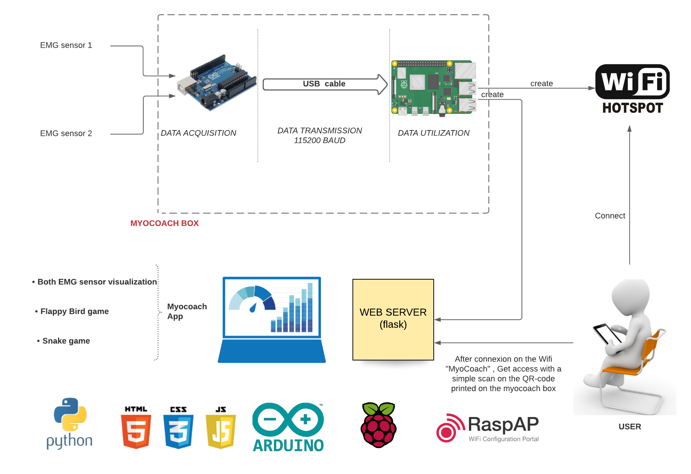
  </a>
  
  The role of the arduino board is to receive the analog signals and convert them to digital and finally to send them via the serial port to the raspberry pi board. The raspberry pi board is the main element of our system.It receives EMG data from the arduino board at any time. It creates the web server and a hospot directly when it starts up. The user can connect to this network and thus access the application to view the ELG data or play the serious game.

### Installation

You can design the MyoCoach for less than **70€**. More details in the [COSTS](cost.md) file.

Follow this steps to make your own **MyoCoach**

**:one:Make the box**

In this manual you will find all the resources to design the various components of the MyoCoach. You will see that we don't take into account the raspberry pi emplacement, you can make externe by using his base box or adding it in the MyoCoach box by increase the dimension following the dimension of the raspberry pi. 

* The [armband](#armband)
* The Arduino board [casing](#casing)

## List of equipment
To design the MyoCoach, you will need :

* A 3D printer
* PLA type filament
* An Arduino UNO type board [link](https://store.arduino.cc/arduino-uno-rev3)
* A Raspberry pi [link](https://www.amazon.de/s?k=raspberry+pi+3+power&language=en_GB&adgrpid=81839545643&gclid=Cj0KCQiA0rSABhDlARIsAJtjfCchVfK8rE3ZXNvtey9SQwFffEQdmVJsKJW1rsvMP4mvpajCZgK8-k8aAh0_EALw_wcB&hvadid=394726547717&hvdev=c&hvlocphy=9056566&hvnetw=g&hvqmt=b&hvrand=8472442571307097874&hvtargid=kwd-301757869141&hydadcr=4926_1792628&tag=googdemozdesk-21&ref=pd_sl_533w78fssn_b)

* A female pin header strip [link](https://fr.farnell.com/samtec/ssq-110-03-f-s/connect-femelle-10-voies-1-rang/dp/2667433)
* A male pin header strip [link](https://fr.farnell.com/amp-te-connectivity/1-826629-0/barrette-droite-1-rangee-10voies/dp/3418376)
* A set of electronic cables [link](https://fr.farnell.com/pro-signal/psg-jws-65/jumper-wire-set-65pc/dp/2503764?MER=bn_level5_5NP_EngagementRecSingleItem_3)
* Self-tapping screws 8 x ∅2.2-L5 [link](https://www.visseriefixations.fr/catalog/product/view/id/38717)
* A strap with velcro and buckle [link](https://www.amazon.fr/gp/product/B07G9XFYM4/ref=ppx_yo_dt_b_asin_title_o05_s00?ie=UTF8&psc=1)


Tools :

* A Phillips screwdriver
* A soldering iron + soldering accessories
* A tube of glue type Glue

<a name="armband"></a>
## The ArmBand
The armband is the component of the MyoCoach that holds the two Ottobock EMG sensors (Ref 13E202) on the residual limb of the future prosthesis user. This armband is comfortable, inexpensive and facilitates the positioning of the sensors for the ortho-prosthetist.

### Printing of the Sensor Supports
The supports have been made with Fusion360 software. 

The file in .STL format is available in [this link](https://github.com/orthopus/01-myocoach/tree/master/src/hardware/casing)

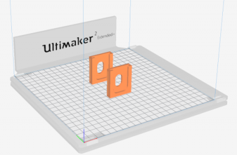

### armband assembly
Prepare the different elements: the printed material, the strap and the EMG sensor.

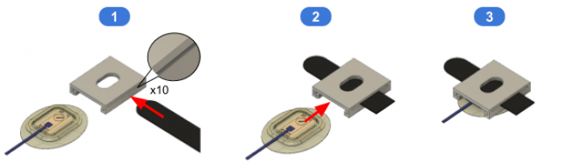

* :one: Insert the strap into the side openings of the media.

> :bulb: The strap must be forced in.


* :two: Insert the Ottobock 13E202 sensor into the holder, taking care to force the strap between the holder and the sensor.

> :bulb: The sensor must go at the end of the mechanical stop in the holder.


### Adjustments and positioning
The design of the sensor holder and especially the design of the slot where the cable passes through offers a certain freedom of positioning between the two sensors. This freedom of movement allows the two EMG sensors to be correctly positioned above the user's muscle areas.

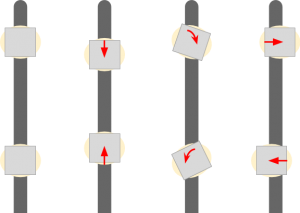

<a name="casing"></a>
## The Casing
The MyoCoach's case allows EMG sensor data to be acquired with an Arduino card and transferred to a computer for visualisation. It also allows the Ottobock electrode connector format to be adapted to the MyoCoach casing.

### Casing printing
The casing of the Arduino Board has been made with Fusion360 software.

STL format files are available in [the link](https://github.com/orthopus/01-myocoach/tree/master/src/hardware/casing)

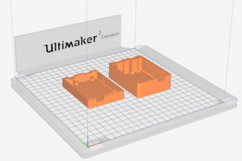

### Preparation of the Arduino card
The main idea is to solder two female connectors (5-pin female pin header strips) to adapt to the female connectors of the Ottobock 13E202 sensors. The connectors are connected to the analogue ports A0 (EMG 0) and A1 (EMG 1) of the Arduino board.

The wiring diagram is as follows:

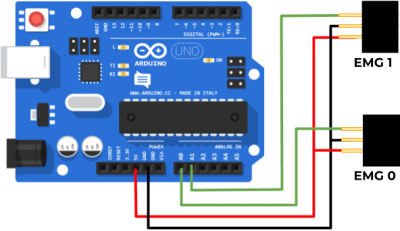

The result is as follows:

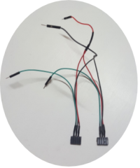

### Casing Assembly
Prepare the following items: the Arduino card, the two parts of the case, the female pin header strips and the 8 self-tapping screws.

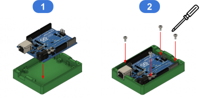

* :one: Insert the Arduino card into the case.

* :two: Screw in the 4 self-tapping screws to hold the Arduino card in the case.

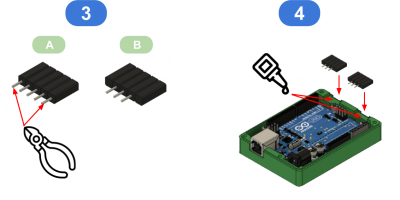

* :three: Using pliers, cut off the 2 outer pins of the snap-off strips.

* :four: To hold the connectors in place in the box, apply 2 drops of glue (Glue type) before placing the connectors in the box.

> :bulb: The cables are not shown in these illustrations but at this stage the connectors must be soldered.


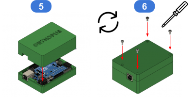

* :five: Close the housing

> :warning: Before closing the case, the connectors must be connected to the Arduino board (+5v, GND, EMG0 → A0, EMG1 → A1).

* :six: Turn the MyoCoach housing over and screw in the 4 self-tapping screws to hold the two housing covers in place.

### Electrode Connector
The connector of the Ottobock 13E202 electrodes is very specific.

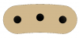


But a simple 3-pin header strip is used to interface between the electrodes and the connectors of the MyoCoach box.

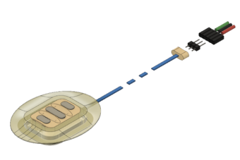


**:two:Boards Preparation**

### Flash the arduino board
The Arduino board fulfils two roles:

* acquiring the signals from the EMG sensors on two analogue inputs
* sending this data to a raspberry  via the USB port by emulating a serial link.

<a >
    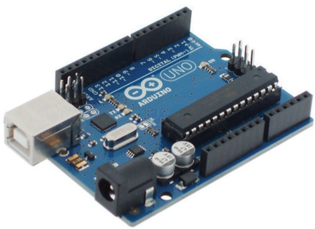
  </a>

 We have used the online programming tool developed by Arduino. You can find help and information about this tool by following this link:
[Getting Started with Arduino Web Editor](https://create.arduino.cc/projecthub/Arduino_Genuino/getting-started-with-arduino-web-editor-on-various-platforms-4b3e4a?f=1)

We prefered to use the most basic arduino: **arduino uno**  but you can feel free to use another type of arduino...

### Flash the Raspberry pi SD card

<a >
    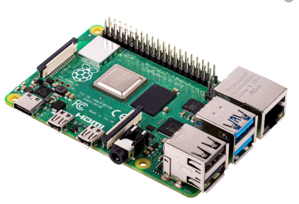
  </a>

The raspberry card needs a **SD card flashed by an operating system**. Several operating systems are available but for this project it will be necessary to use the **raspberry pi OS** ! And you can  take the aspberry pi OS  with the desktop option if your are not familiar to linux sytem. it will be preferable to use a class 10 SD card for more speed and fluidity of the operating system of the raspberry card.

A powerful tutorial  is available [here](https://www.raspberrypi.org/documentation/installation/installing-images/)

**:three: Programmation**


Don't be afraid you will not use to program anything again , just some commands to enter ;). Now you will really begin to build the system !

* :one:  Create an account on the online programming tool developed by Arduino: [Arduino Web Editor](https://create.arduino.cc)

* :two:  Install the Arduino Web Editor [plugin](https://create.arduino.cc/getting-started/plugin)

* :three: Importing the **myocoach.ino** file into the online code editor

* :four: Connecting the Arduino card to the computer you have already installed the arduino software

* :five: Transfer the MyoCoach program to the Arduino card. After doing all these steps, you can remove the arduino board from your pc and plug it into your raspberry pi.

* :six: Considering that you have already flash your raspberry pi SD card following the tutorial we gave you previously , you can plug it on the raspberry pi and start it. 
After the  boot phase , download the MyoCoach file project from your raspberry pi by typing on the terminal of your raspberry pi  this command:

```bash
$ https://github.com/AliouneDiouf/MyoCoach.git
```

 The code that launches the application is the python **app.py** file. You must now make your code automatic when starting the raspberry pi and make your rapsberry pi an access point to generate a hotspot at startup.


* :seven: Make the  automatic on startup

**:six:  Install the Desktop GUI**

Follow the [UI programming manual](./docs/ui-programming-manual.md)


<!-- USAGE EXAMPLES -->
## Usage

Use this space to show useful examples of how a project can be used. Additional screenshots, code examples and demos work well in this space. You may also link to more resources.

_For more examples, please refer to the [Documentation](https://example.com)_


<!-- CONTRIBUTING -->
## Contributing

Contributions are what make the open source community such an amazing place to be learn, inspire, and create. Any contributions you make are **greatly appreciated**.

1. Fork the Project
2. Create your Feature Branch (`git checkout -b feature/AmazingFeature`)
3. Commit your Changes (`git commit -m 'Add some AmazingFeature'`)
4. Push to the Branch (`git push origin feature/AmazingFeature`)
5. Open a Pull Request


<!-- CONTACT -->
## Contact

Your Name - [@your_twitter](https://twitter.com/your_username) - email@example.com

Project Link: [https://github.com/your_username/repo_name](https://github.com/your_username/repo_name)


